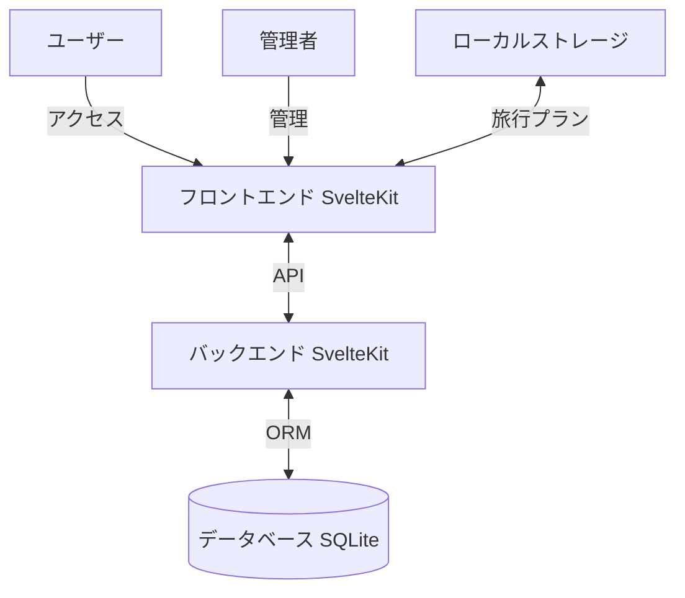

# 1. 背景と目的

- **アプリケーション名**: まなび旅マップ
- このアプリケーションは、管理者が地域情報（名産品、名所、地形など）を手動で追加し、日本地図上にマッピングして公開・共有できるWebサイトを提供します。
- 対象ユーザーは、小学生の社会の勉強をしている児童とその保護者です。教科書で学んだ地域の名産や名所を地図上で確認し、実際にその地を訪れたくなるような体験を提供します。また、学んだ地域を旅行先として選び、旅行の予定を立てられるようにします。

## システムアーキテクチャ

---

# 2. 機能要件

## 2.1 管理画面ログイン機能
- **機能概要**：管理者がシークレットキーの完全一致で管理画面にログインします。

## 2.2 地域情報追加機能
- **機能概要**：管理者が地域（都道府県、市町村）の情報を手動で追加します。地域名、都道府県コード、緯度経度などの基本情報を登録します。

## 2.3 地域情報編集機能
- **機能概要**：管理者が既存の地域情報を編集します。

## 2.4 名産品の追加機能
- **機能概要**：管理者が地域に紐づく名産品を手動で追加します。名産品名、生産量、生産量ランキング（ベスト3など）、説明、画像などを登録します。

## 2.5 名産品の編集機能
- **機能概要**：管理者が既存の名産品情報を編集します。

## 2.6 名所の追加機能
- **機能概要**：管理者が地域に紐づく名所を手動で追加します。名所名、説明、画像、位置情報などを登録します。

## 2.7 名所の編集機能
- **機能概要**：管理者が既存の名所情報を編集します。

## 2.8 地形の追加機能
- **機能概要**：管理者が地域に紐づく特徴的な地形（リアス式海岸、扇状地、三角州など）を手動で追加します。地形名、説明、画像、位置情報などを登録します。

## 2.9 地形の編集機能
- **機能概要**：管理者が既存の地形情報を編集します。

## 2.10 日本地図表示機能
- **機能概要**：ユーザーが日本地図上で地域情報を確認できます。地図上に名産品、名所、地形のマーカーを表示し、クリックすると詳細情報を表示します。
- **地図ウィジェット**：全ページで表示され、現在選択中の地域や情報を視覚的に表示します。

## 2.11 地域詳細表示機能
- **機能概要**：ユーザーが特定の地域を選択すると、その地域の名産品、名所、地形の一覧を表示します。生産量ベスト3などのランキング情報も表示します。

## 2.12 旅行プラン作成機能
- **機能概要**：ユーザーが興味を持った地域や名所を旅行プランに追加し、ブラウザのローカルストレージに保存します。データベースには保存しません。
- **詳細**：旅行プランモジュールを使用して、旅行先の追加、削除、取得を行います。`localStorage`を利用して、地域IDや名所IDを保存します。

## 2.13 ユーザー操作に対するフィードバック
- **機能概要**：ユーザー操作に応じて適切なフィードバックを提供します。

---

# 3. 非機能要件

- **対応デバイス**：PCのみ対応（最新のデスクトップWebブラウザ）
- **ログイン機能**：ユーザーのログイン機能は不要
- **UIデザイン**：必ずTailwind CSSを利用して、CSSのスタイルは直接記述しない
  - 色、フォント、ボタンスタイルの統一
  - 視覚的な階層構造の明確化
  - **テーマカラー**：親子が親しみやすい明るいオレンジ系のテーマを使用
  - **要素の背景色**：カードや要素の背景色は`bg-white`を使用し、影とボーダーで視覚的な階層を表現
  - **ページの背景色**：ページ全体の背景色は`bg-orange-50`を使用
  - **ヘッダー背景色**：ヘッダーの背景色は`bg-orange-400`を使用
  - **アクセントカラー**：オレンジ系（`orange-400`, `orange-500`, `orange-600`）をアクセントカラーとして使用
- **アクセシビリティ要件**：
  - キーボード操作への対応
- **ファイルアップロード処理**:
  - 画像ファイルは/static/upload/ディレクトリ直下に保存することで実現する
- **APIのリクエスト形式**：APIはすべてFormData形式で行うこと
- **地図ライブラリ**：日本地図の表示にはLeafletを使用し、OpenStreetMapのタイルレイヤーを表示する
- **凡例表示**：地図上に名産品、名所、地形の凡例を表示し、各マーカーの色と意味を明確にする

---

# 4. 制約事項

- **フロントエンド**：HTML5, CSS3, JavaScript, SvelteKit
- **バックエンド**：SvelteKit (Bun)
- **データベース**：SQLite
- **ORM**：Prisma
- **開発環境**：ローカル環境で動作
- **セキュリティ対策**：本アプリケーションは書籍で利用するサンプルアプリケーションであるため、利用するライブラリで常識的に対応できる範囲以上のセキュリティ対策は行わない。
- **データベース仕様**：画像ファイルはURLではなく、ファイルシステム上のパスのみをデータベースに保存します。
- **画像保存ディレクトリ**：画像ファイルは`./static/uploads/`ディレクトリに保存します。
- **SVGコード保存ディレクトリ**：SVGコードは`docs/svg/`フォルダに保存されます。
- **データ入力**：データベースの内容は、社会の教科書の内容や中学入試などの問題から別途入力してデータベースとして保持します。本アプリケーションではデータ入力機能は提供しません。
- **サンプルデータ生成**：開発・テスト用にサンプルデータを生成するスクリプトを提供します。
  - `prisma/seed.ts`: 基本的なサンプルデータ（7地域、6名産品、4名所、3地形）を生成
  - `scripts/generate-sample-data.ts`: より多くのサンプルデータ（45地域、14名産品、10名所、5地形）を生成
  - 実行方法: `bun run seed` または `bun run seed:full`
---

# 5. ユースケース

## 5.1 管理者が管理画面にログインし、新しい地域情報を追加する
- **操作手順**：
  1. シークレットキーを入力し、ログインボタンをクリック
  2. 管理ダッシュボードで「地域追加」ボタンをクリック
  3. 地域情報（地域名、都道府県コード、緯度経度など）を入力し、「保存」ボタンをクリック
- **フィードバック**：
  - ログイン失敗時にエラーメッセージを表示
  - 保存成功時に「地域が追加されました」という通知を表示

## 5.2 管理者が既存の地域に新しい名産品を追加する
- **操作手順**：
  1. 管理ダッシュボードで対象の地域を選択
  2. 「名産品追加」ボタンをクリック
  3. 名産品情報（名産品名、生産量、生産量ランキング、説明、画像など）を入力し、「保存」ボタンをクリック
- **フィードバック**：
  - 入力エラー時にエラーメッセージを表示
  - 保存成功時に「名産品が追加されました」という通知を表示

## 5.3 管理者が既存の地域に新しい名所や地形を追加する
- **操作手順**：
  1. 管理ダッシュボードで対象の地域を選択
  2. 「名所追加」または「地形追加」ボタンをクリック
  3. 情報を入力し、「保存」ボタンをクリック
- **フィードバック**：
  - 保存成功時に「情報が追加されました」という通知を表示

## 5.4 管理者が既存の地域情報、名産品、名所、地形を編集する
- **操作手順**：
  1. 一覧から対象を選択
  2. 「編集」ボタンをクリック
  3. 情報を更新し、「保存」ボタンをクリック
- **フィードバック**：
  - 更新成功時に「情報が更新されました」という通知を表示

## 5.5 ユーザーが日本地図上で地域情報を確認する
- **操作手順**：
  1. トップページで日本地図を表示
  2. 地図上のマーカーをクリックして地域情報を確認
  3. 名産品、名所、地形の詳細情報を閲覧
- **フィードバック**：
  - マーカーをホバーすると地域名や情報の種類を表示
  - クリックすると詳細情報をモーダルまたはサイドパネルで表示

## 5.6 ユーザーが特定の地域の詳細情報を確認する
- **操作手順**：
  1. 地図上または地域一覧から地域を選択
  2. 地域詳細ページで名産品の生産量ベスト3などのランキングを確認
  3. 名所や地形の一覧を確認
- **フィードバック**：
  - ランキング情報を視覚的に分かりやすく表示
  - 各項目の詳細情報へのリンクを提供

## 5.7 ユーザーが興味を持った地域や名所を旅行プランに追加する
- **操作手順**：
  1. 地域詳細ページまたは名所詳細ページで「旅行プランに追加」ボタンをクリック
  2. 旅行プランページで追加した地域や名所を確認
- **フィードバック**：
  - 追加成功時に「旅行プランに追加されました」という通知を表示
  - 旅行プランページで追加した項目の一覧を表示

## 5.8 ユーザーが旅行プランを管理する
- **操作手順**：
  1. 旅行プランページで追加した地域や名所の一覧を確認
  2. 不要な項目を削除ボタンで削除
  3. 旅行プランを確認しながら旅行の予定を立てる
- **フィードバック**：
  - 削除時に確認メッセージを表示
  - 旅行プランの項目を地図上で確認できる

---
# 6. 必要ページ一覧（共通要素を含む）
## 6.0 共通要素
### 6.0.1 ヘッダー
  - **概要**: 全ページに表示されるヘッダー
  - **デザイン**:
    - 背景色: `bg-orange-400`
    - テキスト色: 白
    - 影を付けて視覚的な階層を表現
  - **UIコンポーネント**
    - ロゴ: 🗾の絵文字と「まなび旅マップ」のテキストを横並びで表示（クリックするとトップページへ遷移）
    - グローバルナビゲーションメニュー（ホーム、旅行プランへのリンクのみ）
    - ホバー時のトランジション効果

### 6.0.2 地図ウィジェット
- **概要**: ユーザーが日本地図上で地域情報を確認するためのウィジェット。地図上に名産品、名所、地形のマーカーを表示し、クリックすると詳細情報を表示します。
- **デザイン**
- 全体のレイアウト：
  - 画面の主要エリアに表示され、全幅または指定幅で表示
  - 白い背景のカード内に表示（`bg-white`、影とボーダー付き）
  - Leafletを使用してOpenStreetMapのタイルレイヤーを表示
- マーカー表示：
  - 名産品マーカー：緑色（`#22c55e`）の円形アイコン
  - 名所マーカー：青色（`#3b82f6`）の円形アイコン
  - 地形マーカー：茶色（`#b45309`）の円形アイコン
  - マーカーをクリックするとポップアップで名前を表示
- 凡例表示：
  - 地図の右上に凡例ボックスを表示
  - 白い背景（`bg-white`）に半透明のオーバーレイ
  - 各カテゴリの色と名称を表示
  - 名産品（緑）、名所（青）、地形（茶色）の凡例を表示
- 地図コントロール：
  - ズームイン/ズームアウトボタン（Leafletのデフォルトコントロール）
  - 地図の移動（ドラッグ）
- **UIコンポーネント**：
  - 地図表示: 日本地図を表示します（初期位置: 緯度36.5、経度138.0、ズームレベル6）。
  - マーカー表示: 名産品、名所、地形の位置にマーカーを表示します。
  - マーカークリックハンドラー: マーカーをクリックしたときに詳細情報を表示します。
  - 地図ズームコントロール: 地図のズームレベルを調整します。
  - 地図移動コントロール: 地図の表示位置を移動します。
  - フィルター機能: 名産品、名所、地形の表示/非表示を切り替えます。
  - 凡例表示: マーカーの色と意味を説明する凡例を表示します。

### 6.0.3 地域カード
- **概要**: 地域の情報を表示するカード
- **デザイン**:
  - 背景色: `bg-white`
  - ボーダー: `border-2 border-orange-200`
  - ホバー時: `hover:shadow-lg`、`hover:border-orange-400`
  - トランジション効果を追加
- **プロパティ**：
  - `region`: 地域オブジェクト（`Region`型）
- **UIコンポーネント**：
  - 地域名: 地域の名前を表示します（`text-orange-600`）。
  - 都道府県コード: 都道府県コードを表示します（`text-gray-600`）。
  - 名産品数、名所数、地形数: その地域の各情報の数を表示します（`text-gray-500`）。
  - リンク: 地域詳細ページへのリンクを設定します（クリック可能）。

### 6.0.4 名産品カード
- **概要**: 名産品の情報を表示するカード
- **デザイン**:
  - 背景色: `bg-white`
  - ボーダー: `border-2 border-orange-100`
  - 影: `shadow-md`、ホバー時: `hover:shadow-lg`
  - トランジション効果を追加
- **プロパティ**：
  - `product`: 名産品オブジェクト（`ProductWithRegion`型）
- **UIコンポーネント**：
  - **名産品画像**: 名産品の画像を表示します（画像がない場合は`bg-orange-100`のプレースホルダーを表示）。
  - **名産品名**: 名産品の名前を表示します（`text-orange-600`、太字）。
  - **地域名**: 名産品の産地の地域名を表示し、地域詳細ページへのリンクを設定します（`text-gray-600`、ホバー時は`text-orange-500`）。
  - **生産量ランキング**: 生産量ランキング（ベスト3など）を表示します（`text-yellow-500`、⭐アイコン付き、太字）。
  - **生産量**: 生産量の数値を表示します（`text-gray-500`）。
  - **説明**: 名産品の説明を表示します（`text-gray-600`）。
  - **旅行プラン追加ボタン**: 名産品の産地を旅行プランに追加するためのボタン（`bg-orange-400`、ホバー時は`bg-orange-500`）。クリックイベントで旅行プランへの追加を行います。
  - **旅行プラン状態の監視**: 旅行プランへの追加状態を監視し、UIに反映します。

### 6.0.5 名所カード
- **概要**: 名所の情報を表示するカード
- **デザイン**:
  - 背景色: `bg-white`
  - ボーダー: `border-2 border-orange-100`
  - 影: `shadow-md`、ホバー時: `hover:shadow-lg`
  - トランジション効果を追加
- **プロパティ**：
  - `landmark`: 名所オブジェクト（`LandmarkWithRegion`型）
- **UIコンポーネント**：
  - **名所画像**: 名所の画像を表示します（画像がない場合は`bg-orange-100`のプレースホルダーを表示）。
  - **名所名**: 名所の名前を表示します（`text-orange-600`、太字）。
  - **地域名**: 名所の所在地域名を表示し、地域詳細ページへのリンクを設定します（`text-gray-600`、ホバー時は`text-orange-500`）。
  - **説明**: 名所の簡単な説明を表示します（`text-gray-600`）。
  - **旅行プラン追加ボタン**: 名所を旅行プランに追加するためのボタン（`bg-orange-400`、ホバー時は`bg-orange-500`）。クリックイベントで旅行プランへの追加を行います。
  - **旅行プラン状態の監視**: 旅行プランへの追加状態を監視し、UIに反映します。

### 6.0.6 地形カード
- **概要**: 地形の情報を表示するカード
- **デザイン**:
  - 背景色: `bg-white`
  - ボーダー: `border-2 border-orange-100`
  - 影: `shadow-md`、ホバー時: `hover:shadow-lg`
  - トランジション効果を追加
- **プロパティ**：
  - `terrain`: 地形オブジェクト（`TerrainWithRegion`型）
- **UIコンポーネント**：
  - **地形画像**: 地形の画像を表示します（画像がない場合は`bg-orange-100`のプレースホルダーを表示）。
  - **地形名**: 地形の名前（リアス式海岸、扇状地など）を表示します（`text-orange-600`、太字）。
  - **地域名**: 地形の所在地域名を表示し、地域詳細ページへのリンクを設定します（`text-gray-600`、ホバー時は`text-orange-500`）。
  - **説明**: 地形の特徴や説明を表示します（`text-gray-600`）。

## 6.1 ユーザー向けページ
### 6.1.1 トップページ (/)

- **概要**：日本地図を表示し、地域情報を確認できるページ
- **ページタイトル**: 「まなび旅マップ - 日本地図で地域情報を発見」
- **共通UI要素**：
  - **ヘッダー**
  - **地図ウィジェット**（全ページで表示）
- **主要なUIコンポーネント**：
  - **ページタイトル**: オレンジ色の大きなタイトル（`text-orange-600`）
  - **フィルターセクション**
    - 白い背景のカード内に表示（`bg-white`、`border-2 border-orange-200`）
    - チェックボックスと色のインジケーターを横並びで表示
    - 名産品（緑）、名所（青）、地形（茶色）の色インジケーターを表示
    - 名産品、名所、地形の表示/非表示を切り替え
  - **日本地図表示**
    - 白い背景のカード内に表示（`bg-white`、`border-2 border-orange-200`）
    - 地図上に名産品、名所、地形のマーカーを表示
    - マーカーをクリックすると詳細情報を表示
    - 凡例を地図の右上に表示
  - **地域一覧**
    - 地域カードの一覧表示（グリッドレイアウト）
  - **名産品一覧**
    - セクションタイトル（`text-orange-600`）
    - 名産品カードの一覧表示（グリッドレイアウト）
  - **名所一覧**
    - セクションタイトル（`text-orange-600`）
    - 名所カードの一覧表示（グリッドレイアウト）
  - **地形一覧**
    - セクションタイトル（`text-orange-600`）
    - 地形カードの一覧表示（グリッドレイアウト）

### 6.1.2 地域詳細ページ (/regions/[id])

- **概要**：特定の地域の詳細情報（名産品、名所、地形）を表示するページ
- **共通UI要素**：
  - **ヘッダー**
  - **地図ウィジェット**
- **主要なUIコンポーネント**：
  - **ページタイトル**: 地域名を大きなタイトルで表示（`text-orange-600`）
  - **地域情報セクション**
    - 白い背景のカード内に表示（`bg-white`、`border-2 border-orange-200`）
    - セクションタイトル（`text-orange-600`）
    - 地域名
    - 都道府県コード
    - 地域の説明（`text-gray-600`）
  - **地図表示**
    - 白い背景のカード内に表示（`bg-white`、`border-2 border-orange-200`）
    - その地域の名産品、名所、地形のマーカーを表示
  - **生産量ベスト3セクション**
    - 白い背景のカード内に表示（`bg-white`、`border-2 border-orange-200`）
    - セクションタイトル: 「⭐ 生産量ベスト3」（`text-orange-600`）
    - 生産量ランキング1〜3位の名産品を3列グリッドで表示
    - 名産品カードの一覧
  - **名産品一覧**
    - セクションタイトル（`text-orange-600`）
    - 名産品カードの一覧表示（グリッドレイアウト）
  - **名所一覧**
    - セクションタイトル（`text-orange-600`）
    - 名所カードの一覧表示（グリッドレイアウト）
  - **地形一覧**
    - セクションタイトル（`text-orange-600`）
    - 地形カードの一覧表示（グリッドレイアウト）

### 6.1.3 旅行プランページ(/travel-plan)

- **概要**：ユーザーが追加した旅行先候補を表示し、管理・確認が可能なページ
- **ページタイトル**: 「旅行プラン - まなび旅マップ」
- **共通UI要素**：
  - **ヘッダー**
  - **地図ウィジェット**
- **主要なUIコンポーネント**：
  - **ページタイトル**: オレンジ色の大きなタイトル（`text-orange-600`）
  - **地図表示**
    - 白い背景のカード内に表示（`bg-white`、`border-2 border-orange-200`）
    - 旅行プランに追加した地域や名所を地図上で確認
  - **旅行プラン一覧**
    - 白い背景のカード内に表示（`bg-white`、`border-2 border-orange-200`）
    - セクションタイトル: 「旅行先候補」（`text-orange-600`）
    - 追加した地域名または名所名（`text-orange-600`、太字）
    - 項目の種類（地域/名所）と位置情報（緯度、経度）を表示（`text-gray-600`）
    - 各項目は`bg-orange-50`の背景で表示し、ホバー時にボーダーが変化
    - 削除ボタン（`bg-red-500`、ホバー時は`bg-red-600`）
  - **空状態表示**
    - 旅行プランに項目がない場合のメッセージを表示

## 6.2 管理者向けページ

### 6.2.1 管理者ログインページ(/admin/login)

- **概要**：シークレットキーを入力して管理画面にログインします。
- **ページタイトル**: 「まなび旅マップ - 管理画面」
- **共通UI要素**：
  - **ヘッダー**
    - ロゴ
- **デザイン**:
  - ログインフォームは白い背景のカード内に表示（`bg-white`、`border-2 border-orange-200`）
  - 中央配置
- **主要なUIコンポーネント**：
  - **ページタイトル**: 「まなび旅マップ - 管理画面」（`text-orange-600`、中央揃え）
  - **シークレットキー入力フィールド**：セキュアなパスワード入力フィールド（`border-2 border-orange-200`、フォーカス時は`border-orange-400`）。
  - **ログインボタン**：オレンジ色のボタン（`bg-orange-400`、ホバー時は`bg-orange-500`）。クリックして認証を行います。
  - **エラーメッセージ表示エリア**：認証失敗時にエラーを表示（`bg-red-50`、`border border-red-200`、`text-red-500`）。

### 6.2.2 管理画面トップ(/admin)
- **概要**：地域情報、名産品、名所、地形のデータを一元管理できる管理者トップページ。現状は特に表示する要素が存在しないため、/admin/regions/へリダイレクトする

#### 地域管理ページ(/admin/regions/)
- **概要**：地域の一覧表示、追加、編集を行います。
- **デザイン**:
  - ページ背景: `bg-orange-50`
  - テーブル: 白い背景（`bg-white`）、オレンジのボーダー（`border-2 border-orange-200`）
  - テーブルヘッダー: `bg-orange-100`、`text-orange-700`
  - テーブル行: ホバー時に`bg-orange-50`に変化
- **API**：
  - GET /api/regions 地域情報の取得
  - POST /admin/api/regions 地域の追加
  - PUT /admin/api/regions 地域の更新
- **UIコンポーネント**：
  - **地域一覧テーブル**：
    - 地域名
    - 都道府県コード
    - 登録日
    - 名産品管理ページへのリンク(/admin/regions/[id]/products)（`text-orange-500`）
    - 名所管理ページへのリンク(/admin/regions/[id]/landmarks)（`text-orange-500`）
    - 地形管理ページへのリンク(/admin/regions/[id]/terrains)（`text-orange-500`）
    - 編集ボタン（`bg-yellow-400`、ホバー時は`bg-yellow-500`）

  - **新規地域追加ボタン**（`bg-orange-400`、ホバー時は`bg-orange-500`）
  - **新規地域追加モーダル**
    - 白い背景（`bg-white`）、オレンジのボーダー（`border-2 border-orange-200`）
    - モーダルタイトル（`text-orange-600`）
    - 地域名
    - 都道府県コード
    - 緯度
    - 経度
    - 説明
    - 画像ファイル（オプション）
    - 入力フィールドは`border-2 border-orange-200`、フォーカス時は`border-orange-400`

#### 名産品管理ページ(/admin/regions/[id]/products)

- **概要**：名産品の一覧表示や詳細情報の管理を行います。
- **デザイン**:
  - ページ背景: `bg-orange-50`
  - テーブル: 白い背景（`bg-white`）、オレンジのボーダー（`border-2 border-orange-200`）
  - テーブルヘッダー: `bg-orange-100`、`text-orange-700`
- **API**：
  - GET /api/products 名産品の取得
  - POST /admin/api/products 名産品情報の追加
  - PUT /admin/api/products 名産品情報の更新
- **UIコンポーネント**：
  - **名産品一覧テーブル**：
    - 名産品名
    - 地域名
    - 生産量
    - ランキング
    - 編集ボタン（`bg-yellow-400`、ホバー時は`bg-yellow-500`）
  - **新規名産品追加ボタン**（`bg-orange-400`、ホバー時は`bg-orange-500`）
  - **新規名産品追加モーダル**
    - 白い背景（`bg-white`）、オレンジのボーダー（`border-2 border-orange-200`）
    - モーダルタイトル（`text-orange-600`）
    - 名産品名
    - 生産量（オプション）
    - ランキング（オプション）
    - 説明（オプション）
    - 緯度（オプション）
    - 経度（オプション）
    - 名産品画像（オプション）

#### 名所管理ページ(/admin/regions/[id]/landmarks)

- **概要**：名所の一覧表示や詳細情報の管理を行います。
- **デザイン**:
  - ページ背景: `bg-orange-50`
  - テーブル: 白い背景（`bg-white`）、オレンジのボーダー（`border-2 border-orange-200`）
  - テーブルヘッダー: `bg-orange-100`、`text-orange-700`
- **API**：
  - GET /api/landmarks 名所の取得
  - POST /admin/api/landmarks 名所情報の追加
  - PUT /admin/api/landmarks 名所情報の更新
- **UIコンポーネント**：
  - **名所一覧テーブル**：
    - 名所名
    - 地域名
    - 緯度
    - 経度
    - 編集ボタン（`bg-yellow-400`、ホバー時は`bg-yellow-500`）
  - **新規名所追加ボタン**（`bg-orange-400`、ホバー時は`bg-orange-500`）
  - **新規名所追加モーダル**
    - 白い背景（`bg-white`）、オレンジのボーダー（`border-2 border-orange-200`）
    - モーダルタイトル（`text-orange-600`）
    - 名所名
    - 説明（オプション）
    - 緯度
    - 経度
    - 名所画像（オプション）

#### 地形管理ページ(/admin/regions/[id]/terrains)

- **概要**：地形の一覧表示や詳細情報の管理を行います。
- **デザイン**:
  - ページ背景: `bg-orange-50`
  - テーブル: 白い背景（`bg-white`）、オレンジのボーダー（`border-2 border-orange-200`）
  - テーブルヘッダー: `bg-orange-100`、`text-orange-700`
- **API**：
  - GET /api/terrains 地形の取得
  - POST /admin/api/terrains 地形情報の追加
  - PUT /admin/api/terrains 地形情報の更新
- **UIコンポーネント**：
  - **地形一覧テーブル**：
    - 地形名
    - 地域名
    - 緯度
    - 経度
    - 編集ボタン（`bg-yellow-400`、ホバー時は`bg-yellow-500`）
  - **新規地形追加ボタン**（`bg-orange-400`、ホバー時は`bg-orange-500`）
  - **新規地形追加モーダル**
    - 白い背景（`bg-white`）、オレンジのボーダー（`border-2 border-orange-200`）
    - モーダルタイトル（`text-orange-600`）
    - 地形名
    - 説明（オプション）
    - 緯度
    - 経度
    - 地形画像（オプション）

---

# 7. モジュール
## 7.1 地図モジュール
地図モジュールは、日本地図の表示、マーカーの管理、地図操作を提供します。このモジュールは、以下の機能を持っています。

### 7.1.1 地図初期化機能
- **関数名**: `initMap`
- **引数**: `containerId: string, options?: { center?: [number, number]; zoom?: number }`
- **説明**: 指定されたコンテナに日本地図を初期化します。Leafletライブラリを使用して地図を表示します。OpenStreetMapのタイルレイヤーを使用します。デフォルトの中心位置は緯度36.5、経度138.0、ズームレベル6です。

### 7.1.2 マーカー追加機能
- **関数名**: `addMarker`
- **引数**: `marker: Marker`
- **説明**: 地図上にマーカーを追加します。マーカーの種類（名産品、名所、地形）に応じてアイコンの色を変更します。名産品は緑色（`#22c55e`）、名所は青色（`#3b82f6`）、地形は茶色（`#b45309`）の円形アイコンを使用します。

### 7.1.3 マーカー削除機能
- **関数名**: `removeMarker`
- **引数**: `markerId: number`
- **説明**: 指定されたIDのマーカーを地図から削除します。

### 7.1.4 地図ズーム機能
- **関数名**: `setZoom`
- **引数**: `zoom: number`
- **説明**: 地図のズームレベルを設定します。

### 7.1.5 地図中心設定機能
- **関数名**: `setCenter`
- **引数**: `lat: number, lng: number`
- **説明**: 地図の中心位置を設定します。

### 7.1.6 フィルター機能
- **関数名**: `setFilter`
- **引数**: `filter: MapFilter`
- **説明**: マーカーの表示/非表示をフィルターで制御します。`MapFilter`型は`showProducts`、`showLandmarks`、`showTerrains`のブール値を持ちます。

### 7.1.7 ストア
- **`mapInstance`**: 地図インスタンス（LeafletのMapオブジェクト）を保持するSvelteのwritableストア。
- **`markers`**: 地図上のマーカー一覧を保持するSvelteのwritableストア。`Marker`型の配列。
- **`currentFilter`**: 現在のフィルター設定を保持するSvelteのwritableストア。デフォルト値はすべて`true`。
- **`selectedMarker`**: 現在選択中のマーカーを保持するSvelteのwritableストア。`Marker | null`型。

### 7.1.8 エラー処理
- **説明**: 地図モジュール内の各関数は、地図操作時にエラーが発生した場合、詳細なエラーメッセージをコンソールに出力します。これには、エラーの種類、メッセージ、スタックトレース、発生した関数名、エラーが発生したマーカーIDや座標などの情報が含まれます。エラー処理にはtry-catchブロックを使用し、エラーを捕捉してConsoleタブに表示するように処理します。また、ユーザーに対してはエラー発生を通知し、操作が行えなかった理由を明確に伝えることで、エラー調査が容易になります。

## 7.2 旅行プランモジュール

旅行プランモジュールは、ユーザーが旅行先候補を追加、削除、取得する機能を提供します。このモジュールは、以下の機能を持っています。

### 7.2.1 旅行プラン追加機能
- **関数名**: `addToTravelPlan`
- **引数**: `itemId: number, itemType: 'region' | 'landmark', name: string, latitude: number, longitude: number`
- **説明**: 指定された地域IDまたは名所IDを旅行プランに追加します。名前、緯度、経度も一緒に保存します。ローカルストレージに保存されます。既に追加されている項目は重複して追加されません。

### 7.2.2 旅行プラン削除機能
- **関数名**: `removeFromTravelPlan`
- **引数**: `itemId: number, itemType: 'region' | 'landmark'`
- **説明**: 指定された地域IDまたは名所IDを旅行プランから削除します。ローカルストレージに保存されます。

### 7.2.3 旅行プラン取得機能
- **関数名**: `getTravelPlan`
- **引数**: なし
- **説明**: ローカルストレージから旅行プランリストを取得します。`TravelPlanItem[]`型を返します。

### 7.2.4 ストア
- **`travelPlanItems`**: 旅行プランの項目リストを保持するSvelteのwritableストア。`TravelPlanItem[]`型。ローカルストレージと自動的に同期します。
- **ストアメソッド**:
  - `add(item: TravelPlanItem)`: 項目を追加します。
  - `remove(id: number, type: 'region' | 'landmark')`: 項目を削除します。
  - `get()`: 現在の項目リストを取得します。
  - `clear()`: すべての項目を削除します。

---
